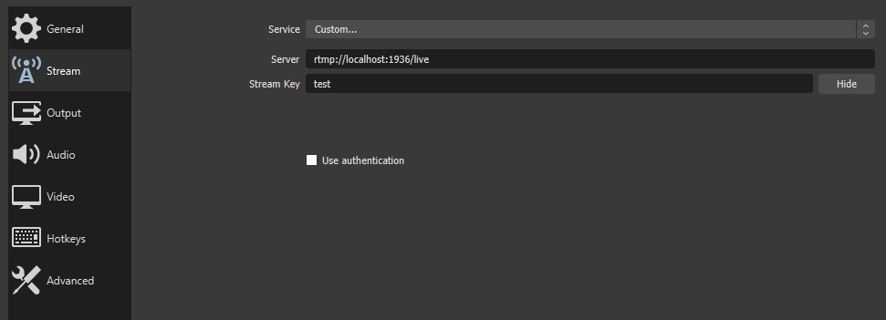

# live-stream-and-video-control-room
---
Video control room for on the fly switch between live-streaming broadcasts and static videos files.
End user (audience) page for project embedding, included.

First release. Further development and updates to follow.
Feedback and/or recommendations definitely welcomed!

## About this repository
---
The repository consists of five parts:
- `backend` - express server, socket.io, written with Typescript, fetching data from "upload" and "stream" folders and from three json files:
"currentLiveVideo",
"streamList",
"userDetails"
- `client` - react client, written with Typescript, Hooks, Context fetching data from the backend and mounted local folders:
"upload" and "stream" 
- `revproxy` - nginx reverse proxy server, serves the backend and frontend applications.
- `rtmp` - nginx rtmp server with custom configuration from dvdgiessen/nginx-rtmp-docker(https://hub.docker.com/r/dvdgiessen/nginx-rtmp-docker/).
- `appproxy` - nginx upstream tcp server which serves the whole application.

## Project layout
---
The app uses `docker compose` with five containers and two volumes.
The `media volume` mounts the static video files form the backend to the frontend.
The `stream volume` mounts the live-stream m3u8 file from the rtmp server to backend for checking purposes and to frontend for use in the video player.


## Remote Server or Local run (Production mode)
---
You need to have [`node`], [`yarn`], [`docker`], [`docker-compose`] installed on the workstation.
```
cd docker-compose
docker-compose build
docker-compose up
```
- If you want to start from scratch is good to clean the volumes before.
```
docker volume rm docker-compose_media
docker volume rm docker-compose_stream
```
- Tested on Ubuntu server and locally on windows machine.
- On AWS free tier the build will be time-consuming because of cpu lack.

## Run for local development (Only frontend and backend)
---
You need to have [`node`] and [`yarn`] installed on the workstation.

```
cd docker-expressApp
yarn
yarn build
yarn watch
```
```
cd docker-reactApp
yarn
yarn dev
```
- Free ports on localhost: 5000, 3000.
- In this setup you cannot test the rtmp server therefore the live-stream functionality.
- The files will be auto-updated.
- In Linux you will need to change the following to both package.json files(docker-expressApp, docker-reactApp):
```
set NODE_ENV="production or development"&&
to
NODE_ENV="production or development"
```
## Using the application
---
- The application is been served through "localhost/" and "localhost/admin".
- For full functionality the use of Google Chrome exclusively is strongly recommended.

### 1 Audience page
- This page includes the final video output(live stream or static video file).
- It is accessable through your server's "localhost/" and can be embeded in other web-applications.
- Includes real-time viewers counter and a live tag when live-streaming is on.


### 2 Admin page
- Ability to maniplulate all the function of the video/live-stream and the account settings of admin or non-admin users.
- It is accessable through your server's "localhost/admin".

#### 2.1 Login page
- Use the followin credentials in the first login.
- Ability to change the credentials at a later stage.
```
username: admin
password: admin
```


#### 2.2 Admin page
- The Admin page is the application's main page where all the functions are available.

##### 2.2.1 Nav Bar
- Two buttons for switching between Control Room and Account Settings.
- Display current user name.
- Live viewers counter.

##### 2.2.2 Header
- Display the video or live-stream that is currently been broadcasted.
- "Go to live button" redirects to the final audience page.


##### 2.2.3 Control Room
###### 2.2.3.1 Add live-stream link button
- Provides the ability to add an extrernal stream source (external from the source application rtmp server).
- It should be provided from a similar rtmp server that generates a m3u8(HLS) stream file.


###### 2.2.3.2 Upload static video file button
- Upload files form your local drive.
- Mulitple files upload is currently not supported.
- The file should be in mp4 format.
- The file size should not exceed 150MB.
- The file size limit can be changed only at built with:
```
docker-reverseProxy/config
client_max_body_size 150M;
```

###### 2.2.3.3 Stream/video list
- The lists includes three types of elements:
1.source live-stream
- It is always the first element, marked with a link icon and has the default name: "live stream". This element cannot be deleted.


2.live-stream
- Can be added from the user with custom name, and is marked with a link icon.
- An example link is provided at built with the name: "user test stream": "https://test-streams.mux.dev/x36xhzz/x36xhzz.m3u8".
- The example link can be deleted.


3.static video file
- After uploaded, the elements appear in the list appearing with the name of the file without the extention.
- On selection, the appearing delete button provides the correspondent functionality. This also applies for the live-stream element.
- The live icon tag appears on the element that is being currently broadcasted live.


###### 2.2.3.4 Stream/video preview area
- Preview of the selected stream/video.

###### 2.2.3.5 Publish video button
- Publish the stream/video to the Audience page in real-time.
- Page is being refreshed automatically without the need of a page reload.

##### 2.2.4 Account Settings
- Non-admin users have only the ability to Change Name and Password section.


###### 2.2.3.1 Change User Name and Password
- Updates users credentials.


###### 2.2.3.2 Manage Users
- Admin user only.


- Add users.


- delete user
Select the user you want to delete.
Admin user cannot be deleted.


###### 3 Live stream
- Stream to source rtmp server through: http://localhost:1936/live/test
- If ran in server 'localhost' should be replaced with the server's ip.
- Where "test" is the streaming key.
- At the moment this is the default streaming key and can only be modified in the source code.
- OBS example:

