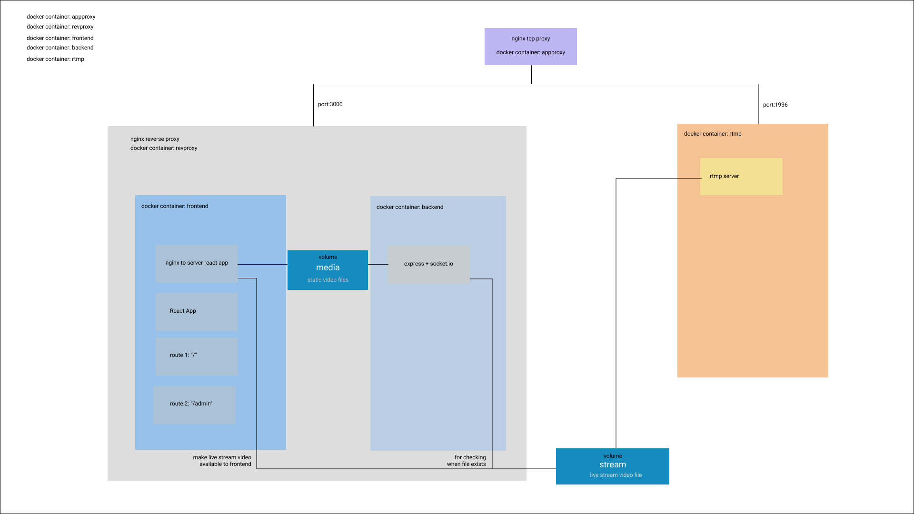

# live-stream-and-video-control-room
---
Happy to present my first open-source project:

#####Video control room for switching between live-stream broadcast and static video files in realtime. 

#####Provides also an end-user(audience) page which can be embeded in your project.

This is the first release and I will continue developing and updating this application.
If you have any questions or feedback please let me know.
Enjoy!!

## About this repository
---
This repository consists of five parts:
- `backend` - express server, socket.io, written with Typescript, fetching data from "upload" and "stream" folders and from three json files:
currentLiveVideo
streamList
userDetails
- `client` - react client, written with Typescript, Hooks, Context fetching data from the backend and mounted local folders:
"upload" and "stream" 
- `revproxy` - nginx reverse proxy server, serves the backend and frontend applications.
- `rtmp` - nginx rtmp server with custom configuration from dvdgiessen/nginx-rtmp-docker(https://hub.docker.com/r/dvdgiessen/nginx-rtmp-docker/).
- `appproxy` - nginx upstream tcp server which serves the whole application.

## Layout of the project
---
The app uses `docker compose` with five containers and two volumes.
The `media volume` mounts the static video files form the backend to the frontend.
The `stream volume` mounts the live-stream m3u8 file from the rtmp server to backend for checking purposes and to frontend for use in the video player.



## Running full application on Remote Server or Locally in production mode
---
You need to have [`node`], [`yarn`], [`docker`], [`docker-compose`] installed on the workstation.
```
cd docker-compose
docker-compose build
docker-compose up
```
- If you want to start from scratch is good to clean the volumes before.
```
docker volume rm docker-compose_media
docker volume rm docker-compose_stream
```
- Tested on Ubuntu server and locally on windows machine.
- On AWS free tier the build will be time-consuming because of cpu lack.

## Running only frontend and backend for local development
---
You need to have [`node`] and [`yarn`] installed on the workstation.

```
cd docker-expressApp
yarn
yarn build
yarn watch
```
```
cd docker-reactApp
yarn
yarn dev
```
- Free ports on localhost: 5000, 3000.
- On this setup you cannot test the rtmp server and as result the live stream functionality.
- Files will be auto-update.
- On Linux machine you will need to change on both package.json files(docker-expressApp, docker-reactApp):
```
set NODE_ENV="production or development"&&
to
NODE_ENV="production or development"
```
## Using the application
---
- The application been served under two route "localhost/" and "localhost/admin".
- Suggested browser Google Chrome.

### 1 Audience page
- This page includes the final video output(livestream or static video file).
- Is accessable on the main route "localhost/" of your server and can be embeded in other web-applications.
- Includes real-time viewers counter and a live tag when live-streaming is on.


### 2 Admin page
- From this page you can maniplulate all the video/live-stream functionality and the account setting of admin and simple users.
- Is accessable on the main route "localhost/admin" of your server.

#### 2.1 Login page
- You can connect with those credentials for the first login.
- You can change the credentials afterwards.
```
username: admin
password: admin
```


#### 2.2 Admin page
- The Admin page is the main page of the application and from here you can maniplulate all the provided functionality.

##### 2.2.1 Nav Bar
- Two buttons for switching between Control Room and Account Settings.
- Display current user name.
- Live viewers counter.

##### 2.2.2 Header
- Display the video or live-stream that is currently been broadcasted.
- "Go to live button" redirects to the final audience page.


##### 2.2.3 Control Room
###### 2.2.3.1 Add live stream link button
- Provides the ability to add an extrernal stream source(not from the source application rtmp server).
- It should be provided from a similar rtmp server that generates a m3u8(HLS) stream file.


###### 2.2.3.2 Upload static video file button
- Upload files form your local drive.
- For now, doesn't support mulitple files upload.
- File should be in mp4 format.
- File size limitation 150MB.
- Modify the size before build at:
```
docker-reverseProxy/config
client_max_body_size 150M;
```

###### 2.2.3.3 Stream/video list
- The lists includes three types of elements:
**1.source live-stream**
Is always the first element, is marked with link icon and has the default name "live stream". This element cannot be deleted.

**2.live stream**
Can be added from the user with custom name, is marked with link icon.

**3.static video file**
- After upload the elements appears in the list with the name of the video file without the extention.
- On selection the delete icon appears giving the ability to delete the element. Apllies also for the live-stream element.
- Live icon tag appears on the element that is currently live-broadcast.


###### 2.2.3.4 Stream/video preview area
- Preview of the selected stream/video.

###### 2.2.3.5 Publish video button
- Publish the stream/video to the Audience page in real-time.
- Audience page user doen't need to reload page.

##### 2.2.4 Account Settings
- Simple user have access only to Change Name and Password section.


###### 2.2.3.1 Change User Name and Password
- Updates users credentials.


###### 2.2.3.2 Manage Users
- Access only from Admin user.


- Add users 


- delete user
Select the user you want to delete.
Admin user cannot be deleted.


